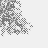
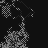
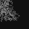

# randomart-generator

Generate OpenSSH style "randomart" images based on any data.

This project was originally based on a cli port of
[slapresta](https://github.com/slapresta/randomart)'s work
by [therebelrobot](https://github.com/therebelrobot/randomart).
The original code was based on
[calmh/randomart](https://github.com/calmh/randomart),
a randomart library written in Go.

This project adds some features:
* Option to generate bitmaps instead of ASCII art
* Option to get raw buffers

## Documentation

The function returned by `require('randomart')` optionally accepts two
arguments: the first one, `data`, is expected to be an array of integers
between 0 and 255, while the second one, `options`, has the following
structure, in which all parent elements are optional.

### Basic usage

Example:
```javascript
const randomart = require('randomart');

console.log(randomart([
  0x9b, 0x4c, 0x7b, 0xce, 0x7a, 0xbd, 0x0a, 0x13,
  0x61, 0xfb, 0x17, 0xc2, 0x06, 0x12, 0x0c, 0xed
]));
```

Result:
```
    .+.
      o.
     .. +
      Eo =
        S + .
       o B . .
        B o..
         *...
        .o+...
```

### Overriding ASCII symbols

```javascript
const randomart = require('randomart')

const options = {
  bounds: {
    width: 17,
    height: 9,
  },
  symbols: {
    '-2': 'E', // End
    '-1': 'S', // Start
    '0': ' ',
    '1': '.',
    // [...]
    '13': '/',
    '14': '^',
  },
  // This is false by default, set to true to get raw data instead of text.
  getRawData: false,
}

const randomartString = randomart(
  [/* your byte array */],
  options,
)
```

### Generating a bitmap instead of text

Example:
```javascript
const randomart = require('randomart')

const options = {
  bounds: {
    width: 48,
    height: 48,
  },
  asBitmap: true,
  darkMode: false,
}

const buffer = randomart(
  [/* 4096-bit RSA key */],
  options,
)
```

```javascript
// If saving the image from Node.js
// ================================

const fs = require('fs')

fs.writeFile('/tmp/your_image.bmp', buffer, console.log)
```

```javascript
// If using this library from a browser
// ====================================

function arrayBufferToString(ab) {
  // https://stackoverflow.com/questions/39725716/how-to-convert-javascript-array-to-binary-data-and-back-for-websocket
  return new Uint8Array(ab).reduce((p, c) => p + String.fromCharCode(c), '')
}

const data = `data:image/bmp;base64,${window.btoa(arrayBufferToString(buffer))}`

const img = document.getElementById('your-image')
img.src = data

```

Light mode example results:




Dark mode example results:




## Credits

Thanks to [@calmh](https://github.com/calmh/randomart) for their hard work! May
the opensource gods reward them with seventy-two non-terrible window managers.
